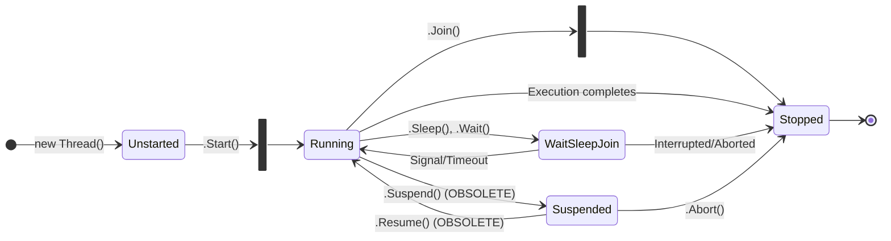

# riton

```mermaid
stateDiagram-v2
    direction LR
    [*] --> Unstarted : new Thread()

    state fork <<fork>>
    Unstarted --> fork : .Start()
    fork --> Running

    state join <<join>>
    Running --> join : .Join()
    join --> Stopped

    Running --> WaitSleepJoin : .Sleep(), .Wait()
    WaitSleepJoin --> Running : Signal/Timeout

    Running --> Suspended : .Suspend() (OBSOLETE)
    Suspended --> Running : .Resume() (OBSOLETE)

    Running --> Stopped : Execution completes
    WaitSleepJoin --> Stopped : Interrupted/Aborted
    Suspended --> Stopped : .Abort()

    Stopped --> [*]
```
